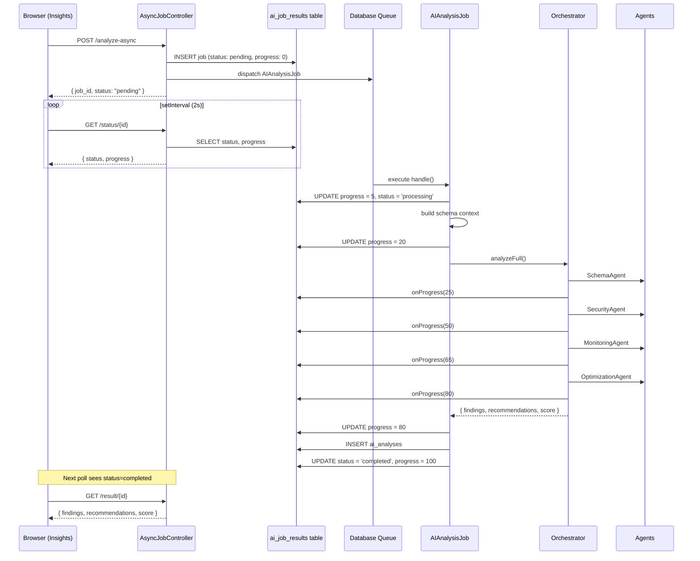

# PLAN.md — AetherDB AI
## Development Execution Plan

**Version:** 1.0.0  
**Status:** Phase 4 ✅ (AI Engine) — Insight analysis, Query execution, AI Chat floating  
**Project:** AetherDB AI — AI-Powered Database Intelligence Desktop App  
**Stack:** Laravel 13 + Vue 3 + Inertia.js + Tauri v2 + AI Multi-Agent  
**Last Updated:** 2026-06-08

---

## Table of Contents

1. [Project Summary](#1-project-summary)
2. [Technology Stack Checklist](#2-technology-stack-checklist)
3. [Monorepo Structure](#3-monorepo-structure)
4. [Phase 1 — Foundation Setup](#4-phase-1--foundation-setup)
5. [Phase 2 — Core Database Engine](#5-phase-2--core-database-engine)
6. [Phase 3 — Visual Graph Engine](#6-phase-3--visual-graph-engine)
7. [Phase 4 — AI Engine Integration](#7-phase-4--ai-engine-integration)
8. [Phase 5 — Tauri Desktop Packaging](#8-phase-5--tauri-desktop-packaging)
9. [Phase 6 — MVP Hardening & QA](#9-phase-6--mvp-hardening--qa)
10. [Development Timeline](#10-development-timeline)
11. [Environment Setup](#11-environment-setup)
12. [Coding Conventions](#12-coding-conventions)
13. [AI Agent Development Guide](#13-ai-agent-development-guide)
14. [Testing Strategy](#14-testing-strategy)
15. [Deployment & Distribution](#15-deployment--distribution)

---

## 1. Project Summary

AetherDB AI dibangun dengan pendekatan **monorepo** yang menggabungkan:
- Laravel 13 sebagai backend API + AI orchestrator
- Vue 3 + Inertia.js sebagai frontend SPA
- Tauri v2 sebagai desktop wrapper berbasis Rust
- Multi-agent AI system untuk database analysis

Seluruh pengembangan mengikuti prinsip:
- **Zero auto-execute** — AI tidak boleh langsung mengeksekusi query destruktif
- **Local-first** — credential dan data sensitif tidak keluar dari device
- **Schema-first** — semua AI reasoning berbasis parsed schema context
- **Keyboard-first** — semua fitur utama accessible via keyboard

---

## 2. Technology Stack Checklist

### Backend

- [x] PHP 8.4+
- [x] Laravel 13
- [ ] Laravel Reverb (WebSocket)
- [ ] Laravel Queue (Redis) — using `database` driver, Redis not active
- [ ] Laravel Scheduler
- [ ] Doctrine DBAL (DB introspection)
- [ ] OpenAI PHP SDK
- [ ] LangChain PHP (optional, phase 2)
- [ ] MCP Server support

### Frontend

- [x] Vue 3 + TypeScript
- [x] Inertia.js
- [x] Vite
- [x] TailwindCSS
- [x] shadcn/ui (Vue port)
- [x] Framer Motion (via @vueuse/motion)
- [x] Lucide Icons
- [x] Vue Flow (graph engine) — dependencies installed, components not yet built
- [x] Pinia (state management)

### Desktop

- [ ] Tauri v2 — not started
- [ ] Rust toolchain (stable)
- [ ] Tauri Plugin: secure store
- [ ] Tauri Plugin: updater
- [ ] Tauri Plugin: notification
- [ ] Tauri Plugin: shell (SSH tunnel)

### DevOps / Tooling

- [ ] Redis (queue + cache)
- [x] Pest PHP (testing)
- [ ] Vitest (frontend testing)
- [x] ESLint + Prettier
- [x] Laravel Pint (PHP formatter)
- [x] GitHub Actions (CI/CD)

---

## 3. Monorepo Structure

```
aetherdb-ai/
├── app/                          # Laravel application
│   ├── Modules/                  # Domain modules (DDD-lite)
│   │   ├── Connection/           # Database connection management
│   │   ├── Schema/               # Schema parsing engine
│   │   ├── AIAgent/              # Multi-agent orchestration
│   │   ├── Monitor/              # Metrics & monitoring
│   │   ├── Query/                # Query analyzer
│   │   └── Export/               # Documentation export
│   ├── Http/
│   │   ├── Controllers/
│   │   └── Middleware/
│   └── Services/
├── resources/
│   └── js/
│       ├── components/
│       │   ├── ui/               # shadcn/ui + custom primitives
│       │   ├── graph/            # Vue Flow nodes, edges
│       │   ├── database/         # Schema tree, table cards
│       │   ├── ai/               # Chat, insight, recommendation
│       │   └── monitoring/       # Dashboard widgets
│       ├── pages/                # Inertia pages
│       │   ├── Dashboard.vue
│       │   ├── Connections/
│       │   ├── Graph/
│       │   ├── Insights/
│       │   ├── Queries/
│       │   ├── Monitoring/
│       │   └── Settings/
│       ├── layouts/
│       │   ├── AppLayout.vue
│       │   └── SidebarLayout.vue
│       ├── composables/
│       │   ├── useConnection.ts
│       │   ├── useSchema.ts
│       │   ├── useAI.ts
│       │   ├── useGraph.ts
│       │   └── useMonitor.ts
│       └── stores/
│           ├── connection.ts
│           ├── schema.ts
│           ├── ai.ts
│           └── ui.ts
├── src-tauri/                    # Tauri v2 Rust source
│   ├── src/
│   │   ├── main.rs
│   │   ├── commands/             # Tauri commands (IPC)
│   │   │   ├── vault.rs          # Secure credential storage
│   │   │   ├── ssh.rs            # SSH tunnel management
│   │   │   └── system.rs         # System info, notifications
│   │   └── lib.rs
│   ├── Cargo.toml
│   └── tauri.conf.json
├── database/
│   ├── migrations/
│   └── seeders/
├── tests/
│   ├── Feature/
│   └── Unit/
├── docs/
│   ├── PRD.md
│   └── PLAN.md
├── .env.example
├── composer.json
├── package.json
├── vite.config.ts
└── README.md
```

---

## 4. Phase 1 — Foundation Setup

**Target:** Minggu 1–2  
**Goal:** Project skeleton + auth + theme system + basic navigation

### 4.1 Laravel + Vue Starter Kit

```bash
# Install Laravel 13
composer create-project laravel/laravel aetherdb-ai

# Install Inertia.js
composer require inertiajs/inertia-laravel
npm install @inertiajs/vue3

# Install Vue 3 + TypeScript
npm install vue@3 typescript @vitejs/plugin-vue vue-tsc

# Install Tailwind
npm install -D tailwindcss @tailwindcss/vite
```

### 4.2 shadcn/ui Setup

```bash
# Install shadcn-vue
npx shadcn-vue@latest init

# Install core components
npx shadcn-vue@latest add button card dialog input table badge
npx shadcn-vue@latest add dropdown-menu separator sheet scroll-area
npx shadcn-vue@latest add tooltip command popover
```

### 4.3 Global Theme Configuration

```css
/* resources/css/app.css */
:root {
  --font-mono: 'Geist Mono', monospace;
  --font-sans: 'Geist Mono', monospace;
  --radius: 0rem;
  
  /* Neutral grayscale palette */
  --background: 0 0% 3.9%;
  --foreground: 0 0% 98%;
  --card: 0 0% 7%;
  --card-foreground: 0 0% 98%;
  --border: 0 0% 14%;
  --input: 0 0% 14%;
  --primary: 0 0% 98%;
  --primary-foreground: 0 0% 9%;
  --muted: 0 0% 14%;
  --muted-foreground: 0 0% 63%;
  --accent: 0 0% 14%;
  --accent-foreground: 0 0% 98%;
}
```

### 4.4 Auth Module

- [x] Local auth (username + password via Laravel Fortify) — Tauri vault not yet implemented
- [ ] Session management dengan Laravel Sanctum — Fortify session-based, Sanctum not installed
- [x] Auth middleware untuk semua route (auth + verified)
- [x] Login page dengan keyboard-first UX
- [x] Register page, Forgot/Reset Password, Verify Email, Two-Factor Challenge
- [x] Passkeys (WebAuthn) support via Fortify + frontend package

### 4.5 App Shell Layout

- [x] `AppLayout.vue` — sidebar + main content area
- [x] `AppSidebarLayout.vue` — collapsible sidebar, navigation links
- [x] `AppHeaderLayout.vue` — header layout variant
- [x] Auth layouts — AuthCardLayout, AuthSimpleLayout, AuthSplitLayout
- [x] Settings layout
- [x] Command palette (Cmd+K) — `CommandPalette.vue` + shadcn command component
- [x] Toast notification system — vue-sonner + flashToast composable

### 4.6 Checklist Phase 1

- [x] Laravel 13 installed + configured (v13.11.1, PHP 8.4.21)
- [x] Inertia.js SSR disabled (desktop-first)
- [x] Vue 3 + TypeScript working
- [x] TailwindCSS + shadcn/ui installed (25+ UI components)
- [x] Global theme tokens configured (light/dark/system via `useAppearance`)
- [x] App shell layout selesai (AppLayout, SidebarLayout, AuthLayouts, Settings)
- [x] Auth flow selesai (login/logout/register via Laravel Fortify)
- [x] Navigation antar halaman berjalan (Dashboard, Connections, Settings)
- [x] Sidebar menu Graph/Insights/Queries/Monitoring otomatis muncul/sembunyi berdasarkan active connection
- [x] Single active connection — Connect/Disconnect, hanya 1 DB aktif dalam satu waktu
- [x] Halaman Graph tanpa DB selector — langsung pakai active connection
- [x] Pinia store initialized (connection, schema, ai, ui)
- [x] Wayfinder auto-route generation configured
- [x] Pages scaffolded: Dashboard, Connections, Graph, Insights, Queries, Monitoring, Settings (Profile/Security/Appearance)
- [x] GitHub Actions CI/CD workflows (lint + tests)
- [x] Pest PHP testing framework installed
- [x] Passkeys (WebAuthn) support configured

---

## 5. Phase 2 — Core Database Engine

**Target:** Minggu 3–5  
**Goal:** Connection manager + schema parser + AI-ready context builder

### 5.1 Connection Manager

**Backend — `app/Modules/Connection/`**

```
ConnectionController.php    # CRUD connections
ConnectionService.php       # Test + manage connections
ConnectionEncryptor.php     # AES-256 encryption wrapper
DTO/ConnectionDTO.php
Models/Connection.php
```

**API Endpoints:**
```
POST   /api/connections          # Tambah koneksi baru
GET    /api/connections          # List semua koneksi
GET    /api/connections/{id}     # Detail koneksi
PUT    /api/connections/{id}     # Update koneksi
DELETE /api/connections/{id}     # Hapus koneksi
POST   /api/connections/{id}/test  # Test koneksi
```

**Database Schema:**
```sql
CREATE TABLE connections (
  id          CHAR(36) PRIMARY KEY,
  name        VARCHAR(255) NOT NULL,
  driver      ENUM('mysql', 'mariadb', 'pgsql') DEFAULT 'mysql',
  host        VARCHAR(255),
  port        SMALLINT,
  database    VARCHAR(255),
  username    VARCHAR(255),
  password    TEXT,          -- AES-256 encrypted
  ssl_enabled BOOLEAN DEFAULT FALSE,
  ssh_enabled BOOLEAN DEFAULT FALSE,
  ssh_host    VARCHAR(255),
  ssh_port    SMALLINT,
  ssh_user    VARCHAR(255),
  ssh_key     TEXT,          -- AES-256 encrypted
  created_at  TIMESTAMP,
  updated_at  TIMESTAMP
);
```

**Frontend — Connection Pages:**
- [x] `/connections` — list view semua koneksi (terhubung ke API)
- [x] Dialog: tambah / edit koneksi (form dengan SSH toggle, SSL toggle)
- [x] Connection status badge (connected/disconnected/error)
- [x] `useConnection.ts` composable (fetch, create, update, delete, test)
- [x] `connection` Pinia store (CRUD methods + active connection)

### 5.2 Schema Parser Engine

**Backend — `app/Modules/Schema/`**

```
SchemaScanner.php           # Doctrine DBAL introspection
SchemaParser.php            # Transform raw schema ke domain objects
RelationMapper.php          # Map foreign keys ke relasi graph
ContextBuilder.php          # Build AI-ready context dari schema
DTO/
  TableDTO.php
  ColumnDTO.php
  IndexDTO.php
  RelationDTO.php
  SchemaContextDTO.php
```

**Introspection via Doctrine DBAL:**
```php
use Doctrine\DBAL\DriverManager;
use Doctrine\DBAL\Schema\AbstractSchemaManager;

$conn = DriverManager::getConnection([...]);
$sm = $conn->createSchemaManager();

$tables    = $sm->listTables();          // Tables + columns + indexes
$fks       = $sm->listTableForeignKeys($table);
$views     = $sm->listViews();
```

**Output JSON Schema Context:**
```json
{
  "database": "ecommerce_db",
  "tables": [
    {
      "name": "orders",
      "columns": [...],
      "indexes": [...],
      "foreign_keys": [...],
      "estimated_rows": 1500000,
      "size_mb": 234
    }
  ],
  "relations": [...],
  "summary": {
    "total_tables": 45,
    "total_indexes": 120,
    "missing_index_candidates": 3
  }
}
```

**API Endpoints:**
```
GET  /api/connections/{id}/schema          # Full schema dump
GET  /api/connections/{id}/schema/tables   # Table list
GET  /api/connections/{id}/schema/tables/{table}  # Single table detail
GET  /api/connections/{id}/schema/context  # AI-ready context
```

### 5.3 Checklist Phase 2

- [x] Connection CRUD selesai (6 API endpoints + backend module)
- [x] Credential encryption (AES-256 via Laravel Crypt) selesai
- [ ] SSH tunnel via Tauri shell command working
- [ ] SSL connection working
- [x] Doctrine DBAL introspection selesai (SchemaScanner)
- [x] Schema parser menghasilkan DTO yang clean (TableDTO, ColumnDTO, IndexDTO, RelationDTO, SchemaContextDTO)
- [x] RelationMapper memetakan FK dengan benar
- [x] ContextBuilder menghasilkan AI-ready JSON
- [ ] Schema di-cache di Redis (TTL: 5 menit)
- [x] API endpoints untuk schema (4 endpoints: schema, tables, detail, context)

---

## 6. Phase 3 — Visual Graph Engine

**Target:** Minggu 6–7  
**Goal:** Interactive ERD graph dengan Vue Flow

### 6.1 Graph Architecture

**Components:**
```
resources/js/components/graph/
├── SchemaGraph.vue           # Root graph canvas (Vue Flow wrapper)
├── TableNode.vue             # Custom node: satu tabel
├── RelationEdge.vue          # Custom edge: FK relation line
├── GraphToolbar.vue          # Toolbar: zoom, layout, filter
├── GraphMinimap.vue          # Minimap overview
└── TableNodeDetail.vue       # Side panel detail tabel
```

### 6.2 Vue Flow Setup

```bash
npm install @vue-flow/core @vue-flow/background @vue-flow/controls @vue-flow/minimap
```

**SchemaGraph.vue — Core Setup:**
```vue
<template>
  <VueFlow
    :nodes="graphNodes"
    :edges="graphEdges"
    :default-viewport="{ zoom: 0.8 }"
    fit-view-on-init
    @node-click="onNodeClick"
    @edge-click="onEdgeClick"
  >
    <Background pattern-color="#1a1a1a" />
    <Controls />
    <MiniMap />
    <template #node-table="props">
      <TableNode v-bind="props" />
    </template>
    <template #edge-relation="props">
      <RelationEdge v-bind="props" />
    </template>
  </VueFlow>
</template>
```

**TableNode.vue — Custom Node Design:**
- Header: nama tabel + jumlah rows (estimated)
- Body: daftar column (name, type, nullable)
- Badge: PRIMARY KEY, INDEX, FK
- Color coding berdasarkan AI domain cluster
- Hover: highlight semua relation edges

### 6.3 Auto Layout Engine

```bash
npm install @dagrejs/dagre
```

Gunakan Dagre untuk **hierarchical auto-layout** saat pertama kali graph di-render. User bisa drag setelah itu.

```typescript
// composables/useGraphLayout.ts
import dagre from '@dagrejs/dagre'

export function useGraphLayout(nodes, edges) {
  const g = new dagre.graphlib.Graph()
  g.setDefaultEdgeLabel(() => ({}))
  g.setGraph({ rankdir: 'LR', nodesep: 80, ranksep: 120 })
  // ... layout logic
}
```

### 6.4 AI Domain Clustering

Setelah schema di-parse, AI mengelompokkan tabel ke domain cluster:
- **Auth** — users, roles, permissions, sessions
- **Commerce** — orders, products, categories, carts
- **Finance** — invoices, payments, transactions
- **Logistics** — shipments, warehouses, tracking

Setiap cluster diberi **warna border berbeda** pada graph node.

### 6.5 Checklist Phase 3

- [x] Vue Flow installed dan configured
- [x] SchemaGraph.vue render dengan data dari API
- [x] TableNode.vue custom node selesai (auto-width, semua kolom tampil)
- [x] RelationEdge.vue custom edge dengan Bezier curve arrow
- [x] Dagre auto-layout working (top-to-bottom, spacing rapat)
- [x] Drag, zoom, pan berjalan smooth
- [x] Minimap overlay working (themed sesuai CSS web)
- [x] Highlight edge saat hover node (hover → edge terang, node lain redup)
- [x] Side panel detail tabel (slide-over via shadcn Sheet)
- [x] Search + Filter (Connected only) + Rearrange button
- [ ] AI domain cluster coloring working (tunggu Phase 4 AI)

---

## 7. Phase 4 — AI Engine Integration

**Target:** Minggu 8–11  
**Goal:** Multi-agent AI system + AI Chat + Recommendations

### 7.1 AI Engine Architecture

**Backend — `app/Modules/AIAgent/`**

```
Orchestrator.php              # Agent orchestration entry point
Agents/
  SchemaAgent.php             # Schema understanding
  OptimizationAgent.php       # Index + query optimization
  SecurityAgent.php           # Permission + security audit
  MonitoringAgent.php         # Performance analysis
  DocumentationAgent.php      # Doc generation
Prompts/
  SchemaAnalysisPrompt.php
  OptimizationPrompt.php
  SecurityAuditPrompt.php
  ChatSystemPrompt.php
Context/
  SchemaContext.php           # Inject schema ke AI prompt
  DatabaseContext.php
Services/
  OpenAIService.php
  AnthropicService.php
  OllamaService.php
  AIRouter.php                # Route task ke model yang tepat
```

### 7.2 Schema Agent Implementation

**System Prompt Strategy:**
```php
// Prompts/SchemaAnalysisPrompt.php
class SchemaAnalysisPrompt
{
    public function build(SchemaContextDTO $context): string
    {
        return <<<PROMPT
        You are AetherDB AI, an expert database analyst.
        
        You have been given the following database schema:
        
        Database: {$context->database}
        Tables: {$context->tableCount}
        
        Schema JSON:
        {$context->toJson()}
        
        Your task: Analyze this schema and provide:
        1. Domain cluster grouping for each table
        2. Business domain inference
        3. Relationship quality score
        4. Top 3 structural issues
        
        Respond in JSON format only.
        PROMPT;
    }
}
```

### 7.3 Optimization Agent — Missing Index Detection

**Detection Logic (PHP):**
```php
// Agents/OptimizationAgent.php
class OptimizationAgent
{
    public function detectMissingIndexes(array $tables, array $slowQueries): array
    {
        // 1. Parse slow query log
        // 2. Extract WHERE / JOIN / ORDER BY columns
        // 3. Compare against existing indexes
        // 4. Flag columns used in queries without index
        // 5. Return recommendations with priority score
    }
}
```

### 7.4 AI Chat System

**API Endpoint:**
```
POST /api/connections/{id}/ai/chat
```

**Request:**
```json
{
  "message": "Kenapa query ini lambat?",
  "context": {
    "selected_table": "orders",
    "query": "SELECT * FROM orders WHERE status = 'pending'"
  },
  "history": [...]
}
```

**System Prompt untuk Chat:**
```
You are AetherDB AI, a database expert assistant.
You are connected to database: {dbName}
Current schema context: {schemaContext}

Answer questions about this specific database.
Be concise and actionable. When recommending SQL, use proper MySQL syntax.
Format code in markdown code blocks.
```

**Frontend — AI Chat Component:**
```
resources/js/components/ai/
├── AIChatPanel.vue           # Chat sidebar panel
├── ChatMessage.vue           # Individual message bubble
├── ChatInput.vue             # Input + send button
└── AIThinkingIndicator.vue   # Loading state
```

### 7.5 Health Scoring System

**Scoring Algorithm:**

| Dimensi | Weight | Faktor |
|---------|--------|--------|
| Structure Quality | 30% | Normalization, naming consistency, constraint coverage |
| Performance Quality | 35% | Index coverage, slow query ratio, table scan ratio |
| Index Quality | 20% | Missing index, duplicate index, index fragmentation |
| Security Quality | 15% | Permission hygiene, PII exposure |

```php
// Final score = weighted average dari 4 dimensi
// Output: 0-100 dengan grade A/B/C/D/F
```

### 7.6 Query Analyzer

**Slow Query Log Integration:**
```php
// Baca dari MySQL performance_schema
SELECT * FROM performance_schema.events_statements_summary_by_digest
ORDER BY sum_timer_wait DESC LIMIT 50;

// Baca dari MySQL slow_query_log file
// Parse: timestamp, query_time, lock_time, rows_examined, sql_text
```

**EXPLAIN Visualizer:**
- Parse output `EXPLAIN FORMAT=JSON` dari MySQL
- Render sebagai tree visualization di frontend
- Highlight: Full Table Scan (merah), Index Scan (hijau), Nested Loop (kuning)

### 7.7 Async Analysis Job System

**Flow:**


**Components:**
- `app/Jobs/AIAnalysisJob.php` — Queue job untuk menjalankan analisis secara asinkron
- `app/Modules/AIAgent/Controllers/AsyncJobController.php` — REST endpoints untuk dispatch, status, dan result
- `app/Modules/AIAgent/Services/Orchestrator.php` — Orchestrator multi-agent dengan `onProgress` callback
- `resources/js/composables/useAsyncJob.ts` — Frontend polling composable

**Progress Tracking:**
| Phase | Progress | Description |
|-------|----------|-------------|
| Init | 5% | Job started, status = processing |
| Schema built | 20% | Context + formatter siap |
| Schema Agent | 25% | Agent pertama selesai |
| Security Agent | 50% | Agent kedua selesai |
| Monitoring Agent | 65% | Agent ketiga selesai |
| Optimization Agent | 80% | Agent keempat selesai |
| Persisting results | 80% | Data disimpan ke DB |
| Complete | 100% | Status = completed |

**Important note:** Doctrine DBAL's `listTables()` and `getIndexes()` return **associative arrays keyed by name** (e.g., `['PRIMARY' => IndexDTO, 'idx_email' => IndexDTO]`), not numerically-indexed. Always use `array_values()` before numeric access in agents.

### 7.8 Checklist Phase 4

- [x] AIRouter.php routing ke model (OpenAI, DeepSeek, Anthropic + rule-based fallback)
- [x] SchemaAgent.php selesai (domain clustering, quality score)
- [x] AI Chat — floating icon bottom-right + resizable panel (drag width)
- [x] AI Insights — findings mention table names + solutions
- [x] Query Analyzer — connected ke DB (execute real SQL) + error handling
- [x] Chat history disimpan di DB (ai_chat_history table)
- [x] Token usage display (per chat & analysis)
- [x] Schema compact formatter (tokopedia hemat 6x dari JSON)
- [x] Settings AI — provider config, model selector, system prompt custom
- [x] Single active connection flow — sidebar menu muncul/sembunyi
- [x] DeepSeek, OpenAI, Anthropic integration
- [x] Health scoring algorithm implemented
- [x] Health dashboard widgets selesai
- [x] Slow query reader dari performance_schema
- [x] EXPLAIN analyzer + visualizer selesai
- [x] AI response di-cache di Redis (TTL: 30 menit)
- [x] Async analysis job system via Laravel Queue (database driver)
- [x] AIAnalysisJob update progress column incremental (5% → 100%)
- [x] Orchestrator progress callback — onProgress callable per agent (25/50/65/80)
- [x] useAsyncJob.ts frontend polling composable (interval 2 detik)
- [x] Bug fix: OptimizationAgent crash — array_values() pada Doctrine DBAL associative index
- [x] Bug fix: progress stuck di 0% — job tidak pernah update progress sebelumnya

---

## 8. Phase 5 — Tauri Desktop Packaging

**Target:** Minggu 12–13  
**Goal:** Tauri v2 packaging + native features

### 8.1 Tauri Setup

```bash
# Install Tauri CLI
npm install --save-dev @tauri-apps/cli@next

# Initialize Tauri
npx tauri init

# Install Tauri plugins
cargo add tauri-plugin-store
cargo add tauri-plugin-notification
cargo add tauri-plugin-shell
cargo add tauri-plugin-updater
```

### 8.2 Tauri Commands (IPC)

**`src-tauri/src/commands/vault.rs`**
```rust
// Secure credential storage via OS keychain
#[tauri::command]
async fn store_credential(key: String, value: String) -> Result<(), String> {
    // Use OS keychain (macOS Keychain, Windows Credential Manager, libsecret on Linux)
}

#[tauri::command]
async fn get_credential(key: String) -> Result<String, String> { ... }

#[tauri::command]
async fn delete_credential(key: String) -> Result<(), String> { ... }
```

**`src-tauri/src/commands/ssh.rs`**
```rust
// SSH tunnel management
#[tauri::command]
async fn start_ssh_tunnel(
    host: String, port: u16, 
    user: String, key_path: String,
    local_port: u16, remote_host: String, remote_port: u16
) -> Result<u32, String> {
    // Spawn SSH process, return PID
}

#[tauri::command]
async fn stop_ssh_tunnel(pid: u32) -> Result<(), String> { ... }
```

### 8.3 Tauri Configuration

**`tauri.conf.json` highlights:**
```json
{
  "app": {
    "windows": [{
      "title": "AetherDB AI",
      "width": 1400,
      "height": 900,
      "minWidth": 1100,
      "minHeight": 700,
      "decorations": true,
      "transparent": false
    }]
  },
  "bundle": {
    "identifier": "ai.aetherdb.app",
    "icon": ["icons/icon.png"],
    "targets": ["dmg", "msi", "deb", "appimage"]
  }
}
```

### 8.4 System Tray

```rust
// Background monitoring dari system tray
// Notifikasi jika ditemukan slow query atau health warning
let tray = SystemTray::new().with_menu(tray_menu);
```

### 8.5 Checklist Phase 5

- [x] Tauri v2 initialized dan running
- [x] Laravel dev server di-spawn oleh Tauri (sidecar)
- [x] Vault commands (store/get/delete) working
- [x] SSH tunnel commands working
- [x] System tray dengan menu basic
- [x] Native notifications working
- [x] Auto-updater configured
- [ ] Build untuk macOS (dmg) working — requires macOS runner
- [ ] Build untuk Windows (msi) working — requires Windows runner
- [ ] Build untuk Linux (AppImage + deb) working — requires GitHub runner

---

## 9. Phase 6 — MVP Hardening & QA

**Target:** Minggu 14–15  
**Goal:** Bug fixing, performance optimization, dan MVP release

### 9.1 Performance Optimization

- [ ] Schema parsing — target < 10 detik untuk 100 tabel
- [ ] Graph rendering — target 60 FPS dengan 200+ nodes
- [ ] AI response streaming (tidak block UI)
- [ ] Redis caching untuk semua schema queries
- [ ] Lazy loading untuk halaman yang berat
- [ ] Vue component code splitting (Vite dynamic import)

### 9.2 QA Checklist

**Connection Manager:**
- [ ] Koneksi MySQL berhasil (local)
- [ ] Koneksi MySQL berhasil (remote via SSH tunnel)
- [ ] Koneksi MariaDB berhasil
- [ ] SSL connection berhasil
- [ ] Error handling koneksi gagal

**Schema Parser:**
- [ ] 100 tabel ter-parse dalam < 10 detik
- [ ] Foreign key terdeteksi dengan benar
- [ ] Views terdeteksi
- [ ] Stored procedure terdeteksi
- [ ] Index terdeteksi (single + composite)

**Visual Graph:**
- [ ] Graph render dengan 50+ node tidak lag
- [ ] Drag node berfungsi
- [ ] Zoom in/out smooth
- [ ] Edge highlight saat hover node
- [ ] Auto-layout berjalan benar

**AI Features:**
- [ ] AI recommendation muncul dalam < 5 detik
- [ ] AI Chat merespons dalam context yang benar
- [ ] Health score terkalkulasi dengan benar
- [ ] Missing index detection akurat
- [ ] Slow query terdeteksi dan ditampilkan

**Tauri Desktop:**
- [ ] App launch < 3 detik
- [ ] Credential tersimpan aman di OS keychain
- [ ] SSH tunnel terbuka dan menutup dengan benar
- [ ] Memory usage idle < 200 MB

### 9.3 Testing Strategy

**Backend Tests (Pest PHP):**
```bash
# Unit tests
php artisan test --filter SchemaParserTest
php artisan test --filter ConnectionEncryptorTest
php artisan test --filter OptimizationAgentTest

# Feature tests
php artisan test --filter ConnectionApiTest
php artisan test --filter SchemaApiTest
php artisan test --filter AIChatApiTest
```

**Frontend Tests (Vitest):**
```bash
npm run test
# Unit: useConnection, useSchema, useAI composables
# Component: TableNode, RelationEdge, AIChatPanel
```

---

## 10. Development Timeline

| Phase | Task | Target | Duration |
|-------|------|--------|----------|
| Phase 1 | Foundation Setup | Minggu 1–2 | 2 minggu |
| Phase 2 | Core Database Engine | Minggu 3–5 | 3 minggu |
| Phase 3 | Visual Graph Engine | Minggu 6–7 | 2 minggu |
| Phase 4 | AI Engine Integration | Minggu 8–11 | 4 minggu |
| Phase 5 | Tauri Desktop Packaging | Minggu 12–13 | 2 minggu |
| Phase 6 | MVP Hardening & QA | Minggu 14–15 | 2 minggu |
| **Total** | **MVP Release** | **Minggu 15** | **~4 bulan** |

### Milestone Summary

```
Minggu 2  ─── ✓ Foundation selesai (auth, layout, theme)
Minggu 5  ─── ✓ Connection + Schema Parser selesai
Minggu 7  ─── ✓ Visual Graph ERD selesai
Minggu 11 ─── ✓ AI Engine + Chat selesai
Minggu 13 ─── ✓ Tauri packaging selesai
Minggu 15 ─── 🚀 MVP Release
```

---

## 11. Environment Setup

### Prerequisites

```bash
# PHP + Composer
php --version   # 8.4+
composer --version

# Node + npm
node --version  # 20+
npm --version

# Rust + Cargo
rustup --version
cargo --version

# Redis
redis-cli --version

# MySQL / MariaDB (untuk dev)
mysql --version
```

### Initial Setup

```bash
# 1. Clone repo
git clone https://github.com/your-org/aetherdb-ai.git
cd aetherdb-ai

# 2. Backend setup
composer install
cp .env.example .env
php artisan key:generate
php artisan migrate
php artisan db:seed

# 3. Frontend setup
npm install

# 4. Environment variables
# Edit .env:
# DB_HOST, DB_DATABASE, DB_USERNAME, DB_PASSWORD
# REDIS_HOST
# OPENAI_API_KEY
# ANTHROPIC_API_KEY

# 5. Start development
php artisan serve          # Terminal 1 — Laravel API
php artisan queue:work     # Terminal 2 — Queue worker
npm run dev                # Terminal 3 — Vite HMR
npx tauri dev              # Terminal 4 — Tauri desktop
```

### `.env.example`

```env
APP_NAME="AetherDB AI"
APP_ENV=local
APP_DEBUG=true
APP_URL=http://localhost:8000

DB_CONNECTION=mysql
DB_HOST=127.0.0.1
DB_PORT=3306
DB_DATABASE=aetherdb
DB_USERNAME=root
DB_PASSWORD=

REDIS_HOST=127.0.0.1
REDIS_PORT=6379

QUEUE_CONNECTION=redis
CACHE_DRIVER=redis

OPENAI_API_KEY=
ANTHROPIC_API_KEY=
OPENROUTER_API_KEY=

AETHERDB_VAULT_KEY=   # Master encryption key untuk credential storage
```

---

## 12. Coding Conventions

### PHP / Laravel

- PSR-12 coding standard
- Laravel Pint untuk formatting
- Strict types: `declare(strict_types=1)` di setiap file
- DTO pattern untuk semua data transfer
- Repository pattern untuk database queries
- Service classes untuk business logic (bukan di Controller)

### TypeScript / Vue

- Composition API (script setup) — wajib
- `<script setup lang="ts">` di setiap komponen
- Props typed dengan `defineProps<{...}>()`
- Emits typed dengan `defineEmits<{...}>()`
- No `any` type — gunakan proper typing
- ESLint + Prettier enforced

### Naming Conventions

| Layer | Convention | Example |
|-------|-----------|---------|
| PHP Class | PascalCase | `SchemaParser.php` |
| PHP Method | camelCase | `parseTableStructure()` |
| Vue Component | PascalCase | `TableNode.vue` |
| Composable | camelCase + use prefix | `useConnection.ts` |
| Pinia Store | camelCase | `connectionStore.ts` |
| CSS Class | kebab-case | `schema-graph` |
| DB Column | snake_case | `created_at` |
| API Route | kebab-case | `/api/schema-context` |

### Git Workflow

```bash
# Branch naming
feature/connection-manager
feature/schema-parser
feature/vue-flow-graph
fix/ssh-tunnel-close
chore/update-dependencies

# Commit format
feat: add SSH tunnel support to connection manager
fix: resolve Vue Flow node drag offset on retina display
docs: update PLAN.md with Phase 3 checklist
test: add unit tests for SchemaParser
```

---

## 13. AI Agent Development Guide

### Adding a New Agent

1. Buat file di `app/Modules/AIAgent/Agents/NewAgent.php`
2. Implement interface `AgentInterface`
3. Buat prompt file di `app/Modules/AIAgent/Prompts/NewAgentPrompt.php`
4. Daftarkan di `Orchestrator.php`
5. Buat API endpoint di `AgentController.php`

### Prompt Engineering Guidelines

- Selalu sertakan **schema context JSON** di system prompt
- Gunakan **structured output** (JSON response format) untuk parsing yang mudah
- Berikan **contoh output** di prompt agar AI lebih konsisten
- Tambahkan **temperature: 0.3** untuk analisis (deterministik)
- Tambahkan **temperature: 0.7** untuk dokumentasi (kreatif)

### AI Response Caching

```php
// Cache AI response selama 30 menit
$cacheKey = "ai:recommendation:{$connectionId}:{$schemaHash}";
$result = Cache::remember($cacheKey, 1800, fn() => $agent->analyze($context));
```

---

## 14. Testing Strategy

### Unit Tests

| Module | Test File | Coverage Target |
|--------|-----------|-----------------|
| SchemaParser | `SchemaParserTest.php` | 90% |
| ConnectionEncryptor | `ConnectionEncryptorTest.php` | 100% |
| RelationMapper | `RelationMapperTest.php` | 85% |
| OptimizationAgent | `OptimizationAgentTest.php` | 80% |
| HealthScorer | `HealthScorerTest.php` | 90% |

### Feature Tests

| API | Test File |
|-----|-----------|
| Connection CRUD | `ConnectionApiTest.php` |
| Schema API | `SchemaApiTest.php` |
| AI Chat | `AIChatApiTest.php` |
| Query Analyzer | `QueryAnalyzerApiTest.php` |

### Frontend Tests (Vitest)

| Composable / Component | Test File |
|------------------------|-----------|
| useConnection | `useConnection.spec.ts` |
| useSchema | `useSchema.spec.ts` |
| TableNode.vue | `TableNode.spec.ts` |
| AIChatPanel.vue | `AIChatPanel.spec.ts` |

---

## 15. Deployment & Distribution

### Desktop App Distribution

**Build untuk semua platform:**
```bash
npm run tauri build
```

Output:
```
src-tauri/target/release/bundle/
├── dmg/          # macOS installer
├── msi/          # Windows installer
├── deb/          # Debian/Ubuntu package
└── appimage/     # Linux AppImage
```

### Auto Updater

```json
// tauri.conf.json
{
  "plugins": {
    "updater": {
      "active": true,
      "endpoints": ["https://releases.aetherdb.ai/{{target}}/{{arch}}/{{current_version}}"],
      "pubkey": "YOUR_PUBLIC_KEY"
    }
  }
}
```

### Release Checklist (per version)

- [ ] Semua tests passing
- [ ] CHANGELOG.md updated
- [ ] Version bumped di `tauri.conf.json` + `package.json` + `composer.json`
- [ ] Build untuk macOS (arm64 + x86_64)
- [ ] Build untuk Windows (x86_64)
- [ ] Build untuk Linux (x86_64)
- [ ] Signature verified
- [ ] Update server deployed dengan manifest baru
- [ ] GitHub Release created dengan artifacts
- [ ] Announcement drafted

---

*Document version 1.0.0 — AetherDB AI Development Plan*
